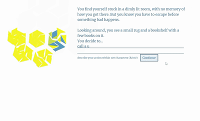

# my-ai-adventure-engine

This is a lightweight web application engine that allows you to create and host your AI-powered text adventure games. Unlike traditional text adventures, which often limit players to pre-defined options, this engine leverages OpenAI's powerful Davinci 3.5 API to dynamically respond to players' actions, allowing them to co-create a unique and immersive experience with the author each time they play.

The engine reads JSON format screenplays. You have the flexibility to specify where to embed AI interactions and what prompts and API parameters to use. This means you can craft rich and complex narratives that evolve and adapt to the player's decisions, while still maintaining control over the generated stories.

It is built on Python web framework Flask, so you can easily host it on your personal computer or server, inviting players to your world. The default visual style is minimalistic, featuring interactive animations that guide players through the game. You have the option to replace these elements with your own tailored designs.




## Installation and Setup
To get started with this project, follow the steps below:
1. **Download the code**
2. **Install dependencies**: Navigate to the project directory and run `pip install -r requirements.txt`.
3. **Get your OpenAI API key**: Go to [OpenAI Account API Keys](https://platform.openai.com/account/api-keys) and obtain your API key.
4. **Set the API key**: Set the value of your API key as an environment variable called `openai_api_key`. Alternatively, you can store it in a `.env` file.
5. **Run the application**: Navigate to the code folder and execute `python run.py`.
6. **Access the application**: Open your preferred web browser and enter the URL `http://localhost:8367`


## Writing Your Own Screenplay
To get started with writing your own screenplay, follow the steps below:
1. **Copy the screenplay template**: Go to the project's `/static/screenplays folder` and make a copy of the `demo.json` file. Rename the copied file with your desired screenplay name.
2. **Edit your screenplay**: Open the newly copied screenplay file and customize it according to your creative vision. Detailed explanations for the editing process will be provided in a later section.
3. **Rerun the application**: After you have finished editing your screenplay, save the file and rerun the application. Access your screenplay by visiting the URL `http://localhost:8367/read/[your_screenplay_name]`. Remember to replace `[your_screenplay_name]` in the URL with the actual name of your screenplay.


## Screenplay Template Guidelines

The screenplay template consists of 4 major parts in the JSON format. `/static/screenplays/demo.json` is a complete example. 
The structure looks like this:
```json
{
    "language_code": "en",
    "opening": [{display block}, ...],
    "steps": [{step block}, ...],
    "ending": [{display block}, ...]
}
```

1. **Language Code**: Set the two-letter language code of the major language used in your screenplay. For example, `"language_code": "en"` for English or `"language_code": "zh"` for Chinese. The language code is not fully utilized in this version. If you are unsure, you can simply set `"language_code": "en"`.

2. **Opening**: This section consists of a list of display blocks to provide context and introduce your adventure. Although there is no player interaction, you can leverage AI writing to add uncertainty and surprise for each gameplay.

3. **Steps**: This section comprises a list of step blocks. Each step block represents a step in the adventure and includes interactions with the player. You can guide players and utilize AI writing to dynamically change the plot.

4. **Ending**: This section is similar to the opening section but to provide the ending of your adventure.

**Display Block**
The is the main component of your adventure story. The only required field is `"display"`. Here's an example from `demo.json`:
```json
{
    "display":"You find yourself stuck in a dimly lit room, with no memory of how you got there. But you know you have to escape before something bad happens."
}
```
If you need AI-generated writing, the `"prompt"` field is also required. The following parameters are optional: `"suffix"`, `"max_tokens"`, `"temperature"`, `"n"`, `"stop"`, and `"best_of"`. You can refer to the [OpenAI API documentation](https://platform.openai.com/docs/api-reference/completions/create) for detailed explanations of these optional parameters.

In our implementation, `"n"` is tweaked such that only one of the `"n"` choices will be selected during gameplay. The selection criterion is based on the shortest reply with `"finish_reason" == "stop"`. This approach ensures a clean and smooth story flow. On the other hand, `"best_of"` is selected by the API using the criterion of `the highest log probability`. It is strongly recommended to use a suffix to guide the plot. 

In the `"prompt"` field, you have two options for providing context to the AI model:
1. Use `{{all}}` to represent the entire story up to the current point.
2. Use `{{n}}`: If `n >= 0`, it represents the recent n display blocks. If `n < 0`, it represents all contents except for the recent n display blocks.

In the `"display"` field, you can use `{{reply}}` to represent the AI-generated writing within the `"display"` field. 
Here's an example from demo.json:
```json
{
    "prompt":"{{all}} It is",
    "max_tokens":257,
    "temperature":1.7,
    "stop":".",
    "best_of":3,
    "display":"It is{{reply}}."
}
```

**Step Block**
The **Step Block** is used to define player interactions in your adventure. Its structure is as follows:
The structure looks like this:
```json
{
    "intro": [{display block}, ...],
    "interaction": {interaction block},
    "outro": [{display block}, ...]
}
```
1. **Intro**: This is a list of display blocks that provide an introduction to the step. You can leave it as a blank list if there's no specific introduction needed.
2. **Interaction**: This block represents a player interaction within the step. It contains the following required fields: `"hint_0"` (hint displayed above the input box), `"max_input"` (maximum number of characters allowed for input), `"hint_1"` (hint displayed below the input box), `"prompt"` and `"display"`. The other optional parameters are the same as the display block parameters used for AI interaction. Here's an example from demo.json:
```json
"interaction": {
    "hint_0":"You decide to...",
    "max_input":"100",
    "hint_1":"describe your action within 100 characters",
    "prompt":"{{-1}}You {{input}}. ",
    "suffix": ", where you discover a hidden item.",
    "max_tokens":257,
    "temperature":1.3,
    "n":3,
    "display":"{{reply}}, where you discover a hidden item."
}
```
3. **Outro**: This is a list of display blocks that provide an outro or conclusion to the step. You can leave it as a blank list if there's no specific outro needed.

Happy screenwriting!

## Customizing Design and Animation
1. Edit the `main.css` file located in the `/static/style` directory. You can modify the CSS rules to match your desired design.
2. Add your animations in the `/static/animations` directory. You can use `$("#current_state").val()` to control the animation based on the current state of the story. The possible values are as follows:
    An empty string represents the story proceeding.
"I" indicates that player input is needed.
"L" means the system is waiting for the OpenAI API response.
"E" signifies that the story is complete.
Edit `main.css` in `/static/style`

3. Load your animations in the `/static/animations/main.html` file. Replace the following line with the appropriate code that loads your animations:
```html
<script src="/static/p5/my_rug.js" type="text/javascript"></script>
```


This is my first open-source tool, and there are many items on my to-do list. Please stay tuned for updates!

